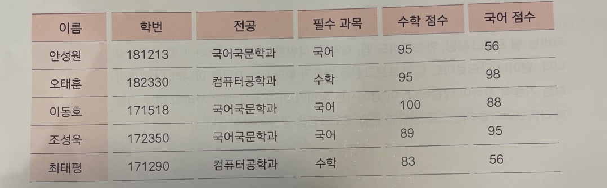
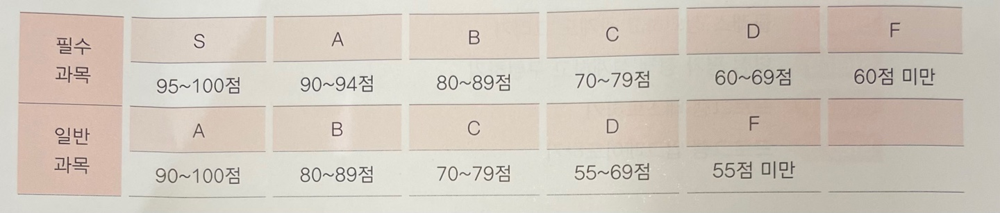

# 📌Java_Basic

## 📈 학점 산출 프로그램
#
### Scenario #1 (문제 정의)  
- Good School 학교에 5명의 학생이 수업을 듣는다  
- 과목은 국어와 수학이 있고, 각 학생은 두과목을 모두 수강한다  
- 그리고 **컴퓨터 공학과** 학생은 수학, **국어국문학과** 학생은 국어가 **필수과목**이다

  

### <학점 부여 기준>  

- 필수과목과 일반과목의 성적 산출 방법이 다르다

#
### Scenario #2 (클래스 정의)  

클래스(멤버변수) :
- 학생클래스(학번, 이름, 전공)
- 과목클래스(과목, ...+)
- 성적클래스(성적, ...+)
- 전공클래스(...+)

-> 학생클래스는 변경가능성이 적으므로 인터페이스 추가 X  
-> 과목클래스는 변경가능성이 적으므로 인터페이스 추가 X  
-> 성적클래스는 추후에 성적산출방법이 바뀔 수 있으니 인터페이스 추가  
-> 전공클래스는 추후에 전공 별 필수과목이 바뀔 수 있으니 인터페이스 추가  

